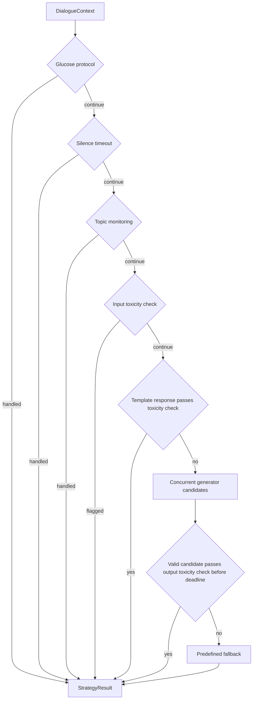

# Affective Dialogue System

A Python research toolkit for dialogue with explicit emotional control in Spanish
and English. It combines structured text generation, response selection, emotion
classification, speech recognition, interest scoring, and speech synthesis.

The core package runs without downloading models. Neural services load their
optional dependencies and weights when instantiated.

## Installation

Use Python 3.10 or newer. For the optional Coqui TTS 0.22 integration, use Python
3.10 or 3.11; that dependency does not support Python 3.12.

```bash
python -m venv .venv
source .venv/bin/activate
python -m pip install -e ".[dev]"
```

Install the integrations you need:

| Extra | Purpose |
| --- | --- |
| `ml` | Dialogue generation, emotion classification, and emotional GPT-2 |
| `asr` | Whisper transcription, including the ML dependencies |
| `tts` | Coqui TTS / XTTS speech synthesis |
| `toxicity` | Detoxify and Llama Guard adapters, including the ML dependencies |
| `dev` | Tests, linting, formatting, and package builds |
| `all` | All runtime integrations |

```bash
python -m pip install -e ".[ml]"
# Optional speech integrations; file transcription also needs FFmpeg on PATH.
python -m pip install -e ".[asr,tts]"
```

## Quick start

These commands work with the core installation and the default local toxicity rules:

```bash
affective-dialogue interest "Siento dolor y mareo"
affective-dialogue toxicity "Hola, hablemos de música"
affective-dialogue select "hola" --language es
```

With the `ml` extra installed:

```bash
affective-dialogue emotion "I am really happy today"
affective-dialogue chat "No puedo creer que hayamos perdido otra vez" \
  --language es --emotion ANGER --second-emotion SADNESS
```

`chat` checks input and output with the configured toxicity filter and generates
one emotional response. `select` runs the protocol/template/fallback selector;
it does not attach a dialogue LLM. To attach one, use the Python example below.
Each CLI invocation is a separate turn; use the Python API for persistent state.

## Dialogue format

The generated response contains three nonempty segments:

```text
(ANGER) Entiendo tu frustración. (SADNESS) Ha sido una derrota dura. (NEUTRAL) ¿Qué mejorarías del equipo?
```

1. The first emotion matches the supplied or classified user emotion.
2. The second emotion is chosen by the caller.
3. The final segment is `NEUTRAL`; the prompt asks for an open-ended continuation.

The parser validates the three emotion tags, their requested order, and nonempty
text. Invalid output produces a predefined response in the selected language.
Empathy, tone, the suggested word count, and open-endedness remain generation
objectives, not properties guaranteed by parsing.

## Dialogue code

This is the complete entry point for a generated turn through response selection.
Install `.[ml]` before running it. The first invocation may download the configured
model; model initialization takes place before the response deadline starts.

```python
from dataclasses import replace

from affective_dialogue_system.config import load_config
from affective_dialogue_system.emotion import Emotion
from affective_dialogue_system.factory import create_dialogue_engine, create_strategy
from affective_dialogue_system.strategy import DialogueContext, DialogueEngineGenerator

config = load_config()
config = replace(
    config,
    selecting_strategy=replace(config.selecting_strategy, llm_timeout_seconds=30.0),
)
generator = DialogueEngineGenerator(
    engine=create_dialogue_engine(config),
    second_emotion=Emotion.SADNESS,
)
context = DialogueContext(
    current_message="No puedo creer que nuestro equipo haya perdido otra vez.",
    user_emotion=Emotion.ANGER,
    language=config.dialogue.language,
)

with create_strategy(config, primary_generator=generator) as strategy:
    result = strategy.select_response(context)
    print(result.response)
    print(f"Selected by: {result.source}")
```

The runnable version is [examples/selecting_dialogue.py](examples/selecting_dialogue.py).
The selector returns the first applicable protocol or template response before
consulting the LLM. Its result identifies the selected source and, where available,
separates the emotional response from the follow-up question.

For direct generation with retained conversation history:

```python
from affective_dialogue_system.config import load_config
from affective_dialogue_system.factory import create_dialogue_engine
from affective_dialogue_system.pipeline import AffectiveDialogueSystem

config = load_config()
conversation = AffectiveDialogueSystem(
    create_dialogue_engine(config),
    max_history_turns=config.dialogue.max_history_turns,
)
response = conversation.reply(
    "Me preocupa la presentación de mañana.",
    user_emotion="FEAR",
    second_emotion="NEUTRAL",
)
print(response.format())
```

`AffectiveDialogueSystem` retains successful turns and can use an injected
`EmotionClassifier` when no emotion is supplied. It is the direct generation API;
protocol selection and toxicity filtering are provided separately by the selector.
See [examples/text_chat.py](examples/text_chat.py).

Implementation links: [history management](src/affective_dialogue_system/pipeline.py),
[prompt construction](src/affective_dialogue_system/dialogue/prompts.py),
[generation](src/affective_dialogue_system/dialogue/engine.py),
[output parsing](src/affective_dialogue_system/dialogue/parser.py), and
[response selection](src/affective_dialogue_system/strategy/selecting_strategy.py).

## Response selection



The application supplies `DialogueContext`: message, emotions, language, topic
counters, optional glucose measurement, timestamps, and history. Keep the same
context to retain protocol state, and append accepted `DialogueTurn` objects to
`dialogue_history` when using the selector across turns. The selector does not
infer topics, run the emotion classifier, or update conversation history itself.

Generators receive independent copies of the context. A selector permits at most
one running job per generator source. The first acceptable result wins; primary
wins a tie. Translation and output moderation count toward the configured LLM
wait deadline. A timed-out Python thread may continue computing; its result is
discarded and its source is skipped while busy. See [architecture](docs/architecture.md)
for shutdown and integration details.

The glucose state machine preserves research prototype behavior. Its software
checks do not establish clinical validity, and it is not a validated medical
protocol. The rule-based toxicity filter is also a heuristic with false positives
and false negatives; optional model detectors do not eliminate those limitations.

## Configuration

Load YAML explicitly with `--config` before the subcommand:

```bash
affective-dialogue --config configs/default.yaml select "hola"
```

[configs/default.yaml](configs/default.yaml) contains the model identifiers,
runtime settings, generation limits, detector switches, and selection thresholds.
Unknown keys, incompatible types, and invalid limits produce an error.

Configuration precedence is: built-in defaults, explicit YAML, exported environment
variables, then supported command-line overrides such as `--model` and `--language`.
The CLI does not automatically read a YAML file or a `.env` file.

| Variable | Effect |
| --- | --- |
| `ADS_DEVICE` | Override the model device, e.g. `cpu` or `cuda:0` |
| `ADS_CACHE_DIR` | Override the Hugging Face cache directory |
| `ADS_SPEAKER_WAV` | Set `config.models.speaker_wav` for applications using TTS |

Without an explicit device, neural services use CUDA when available and CPU
otherwise. For speech synthesis, pass the configured speaker reference to
`CoquiTTSService`; there is no TTS CLI command. Paths are interpreted relative to
the calling working directory.

## Models

| Component | Default identifier |
| --- | --- |
| Dialogue | `mario-rc/emotional-rlaif-dpo-gemma-2-2b-it` |
| Emotional GPT-2 | `mario-rc/emotional-gpt2-medium` |
| Emotion classifier, base | `mario-rc/multilingual-emotional-classifier-xlm-roberta-base` |
| Emotion classifier, large | `mario-rc/multilingual-emotional-classifier-xlm-roberta-large` |
| ASR | `openai/whisper-large-v3-turbo` |
| TTS | `tts_models/multilingual/multi-dataset/xtts_v2` |

Weights and generated audio are excluded from Git. Model availability, access
requirements, reference audio, and hardware must be configured separately.
See [model management](docs/models.md) for downloads and optional adapters.

## Development

```bash
python -m pytest
ruff check src tests examples scripts
ruff format --check src tests examples scripts
python -m build
```

Tests exercise parsing, history, configuration, CLI behavior, protocol transitions,
timeouts, moderation, templates, and adapter contracts without model downloads.
Model adapters use test doubles; full neural inference and audio integration
require separate checks with the selected weights and target hardware.

The CI workflow runs the core checks on Python 3.10, 3.11, and 3.12 and builds both
source and wheel distributions. It does not install or run the optional models.

```text
src/affective_dialogue_system/   Python package and CLI
configs/                        Example runtime configuration
examples/                       Runnable Python examples
tests/                          Unit and regression tests
docs/                           Architecture and model integration notes
scripts/                        Explicit model download helper
assets/                         Small repository assets
```

See [LICENSE](LICENSE) for usage terms.
